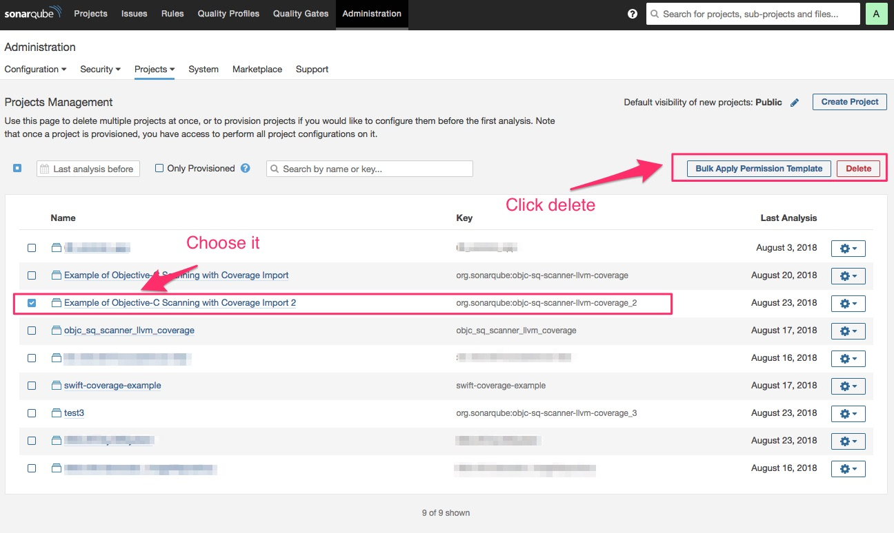

# 測試 sonar qube 上 刪除專案與 LOCs 的關聯

## 說明

* LOCs: 為sonar qube 的最大行數限制

* 測試方案: sonar qube developer edition 250k LOCs 版本

* 測試方式: 刪除某個測試專案，觀察 LOCs 差異

---

### 刪除專案前的的LOCs (154,691 lines)

### 選擇預刪除某project (紅色框部分，該專案有 10 lines)

### 執行刪除該project-step1

### 執行刪除該project-step2

### 點選回到統計所有行數的頁面

### 刪除後的LOCs資訊(154,681 lines)

---

## 結論

* 刪除專案時，其所佔用的LOCs會被扣掉。

* 可設定警戒值(threadhold value)來做預警並整理可刪除專案。

* 不過刪除後記錄會消失(請謹慎處理)。
