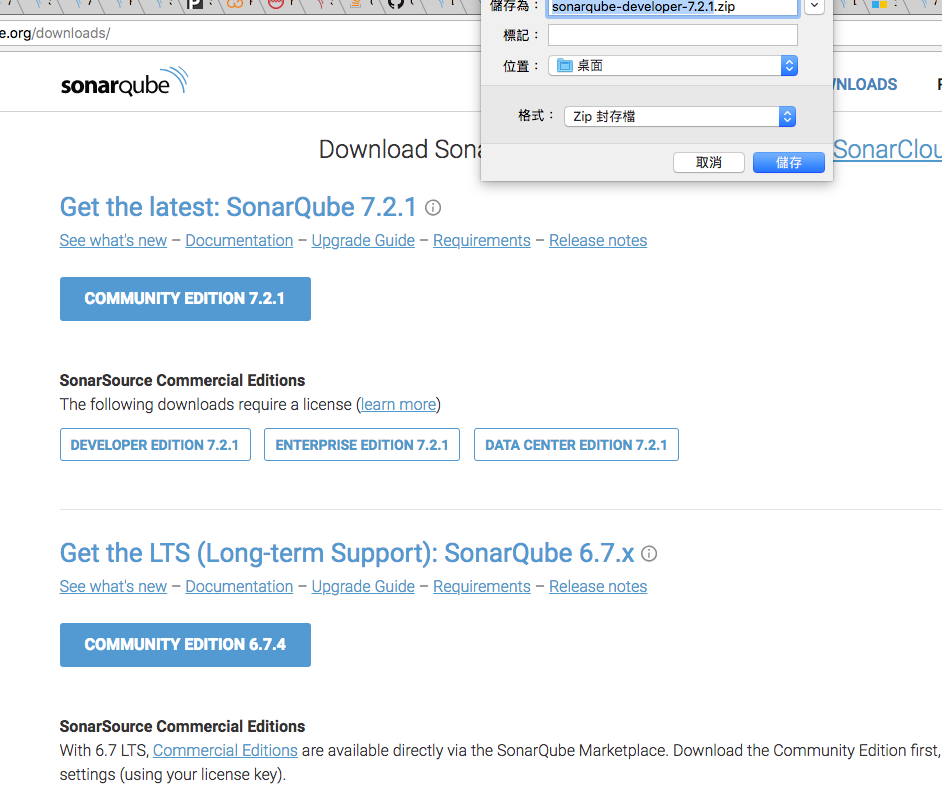

# iOS : Objective-C/Swift 需要 Developer Edition 版本才能剖析。

## Community Edition plus:

* Branch analysis 
* SonarLint notifications 
* Detection of injection flaws 
* 17 languages
  * Java, JavaScript, C#, TypeScript, Go, Flex, Python, PHP, Web, XML,
  * C/C++, Objective-C, PL/SQL, ABAP, VB.NET, TSQL & Swift

# 下載步驟:
 * 選擇方案:
   

 * 輸入資訊:
   

 * 點選下載頁按鈕:
   

 * 點選下載方案按鈕:
   

 * 下載所需檔案:

   

=========================
# 備註
* 可直接到下載頁面下載，後來知道是需要使用 License key
* [下載網址](https://www.sonarqube.org/downloads/)

