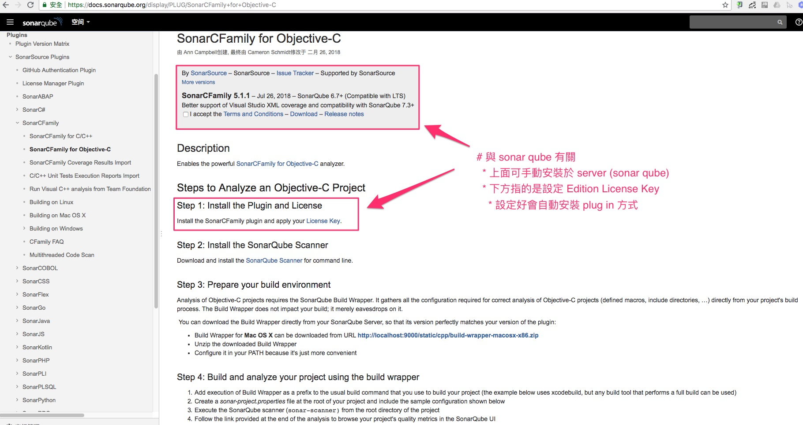
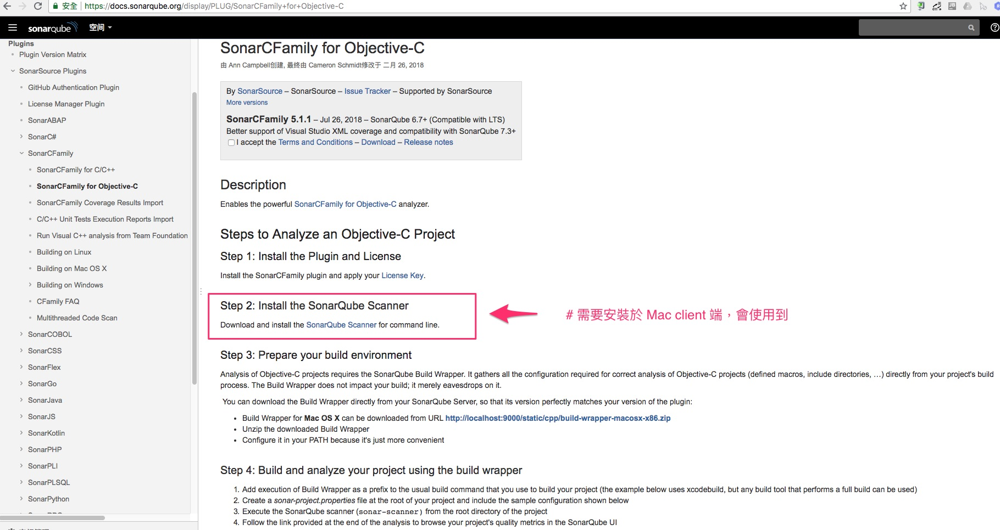
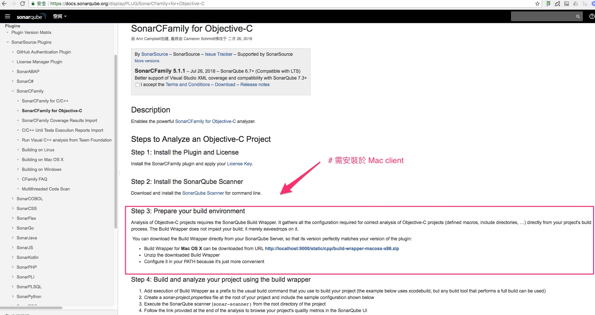
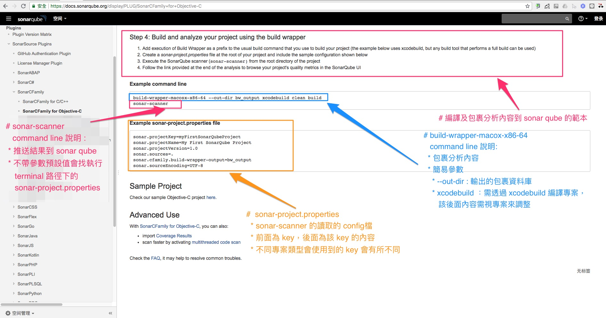

# 官方的參考網址: 針對 Objective-C 的使用方式

* [SonarCFamily+for+Objective-C](https://docs.sonarqube.org/display/PLUG/SonarCFamily+for+Objective-C)

---

## 以下為官網上的說明範例 (製作時間: 2018-08-17)

### 主要分四個步驟

---

* Step 1 簡易說明:

  

  * sonar qube (server) 需要處理設定 Edition 以上版本的 License.
  * 有 license 後，可以手動安裝外掛，或者網站直接安裝。

---

* Step 2 簡易說明:

  

  * mac client 端安裝 sonar-scanner。
  * [細部安裝說明](./sonar-scanner/README.md)

---

* Step 3 簡易說明:

  

  * mac client 端安裝 Build Wrapper。
  * 目前測起來是 cfamily(C/C++，Objective-C)才需要，swift 可以不用。
  * [細部安裝說明](./build-wrapper/README.md)

---

* Step 4 簡易說明:

  

  * Objective-C 主要區分三步驟:

    * Build-Wrapper 包裹 xcodebuild 編譯資訊。
    * coverge : xcrun 來產生 test 的 coverge 檔案 (目前有問題)。
    * sonar-scanner : 剖析 sonar-project.properties 推送到 sonar qube。
