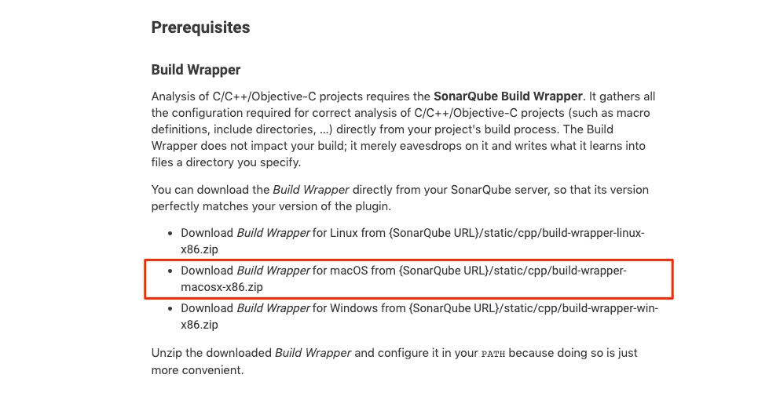
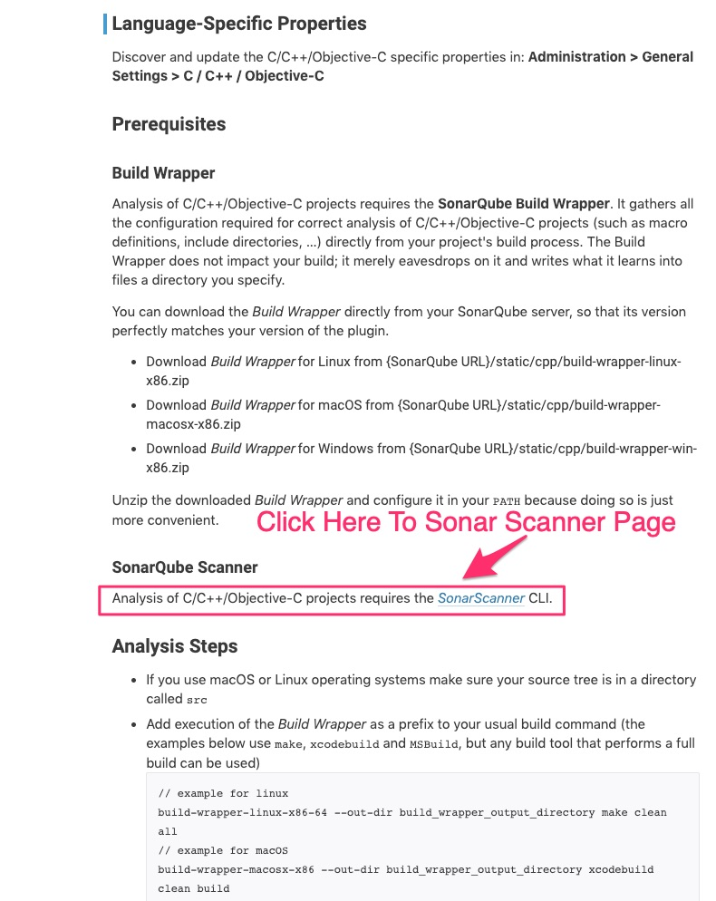
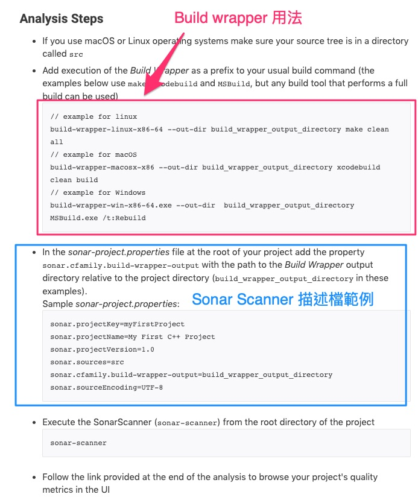

# 官方的參考網址: 針對 Objective-C 的使用方式

* [C/C++/Objective-C | SonarQube Docs](https://docs.sonarqube.org/latest/analysis/languages/cfamily/)

* [SonarScanner | SonarQube Docs](https://docs.sonarqube.org/latest/analysis/scan/sonarscanner/)

---

## 以下為官網上的說明範例 (製作時間: 2019-11-08)

* 主要針對 mac client 需要安裝的前置軟體

### mac client 安裝主要分兩個步驟

---

* Step 1 簡易說明:

  

  * mac client 端安裝 Build Wrapper。
  * cfamily(C/C++，Objective-C)才需要，swift 可以不用。
  * [細部安裝說明](./build-wrapper/README.md)

---

* Step 2 簡易說明:

  

  * mac client 端安裝 sonar-scanner。
  * [細部安裝說明](./sonar-scanner/README.md)

---

* 簡易說明:
  

  * Objective-C 主要區分三步驟:

    * Build-Wrapper 包裹 xcodebuild 編譯資訊。
    * coverge : xcrun 來產生 test 的 coverge 檔案 (目前有問題)。
    * sonar-scanner : 剖析 sonar-project.properties 推送到 sonar qube。

---

* [官方說明文件的備份檔](./Backup.html)
