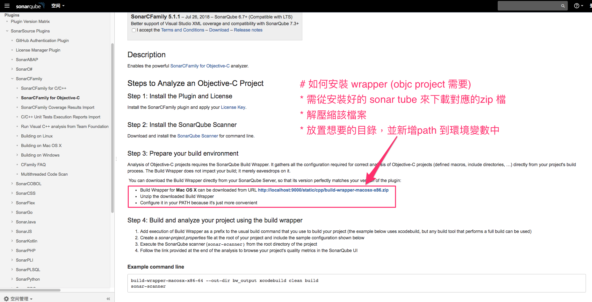
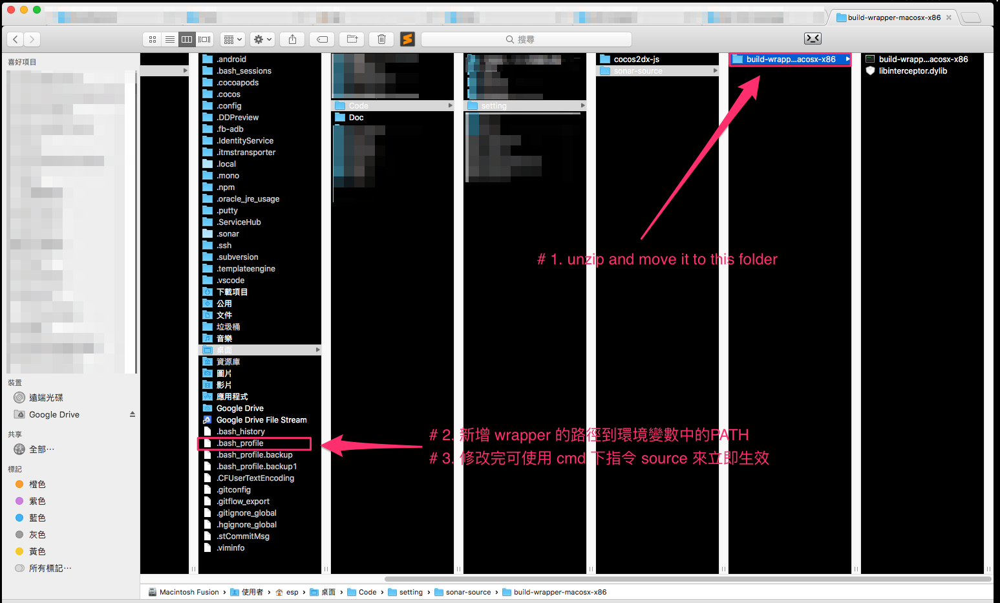
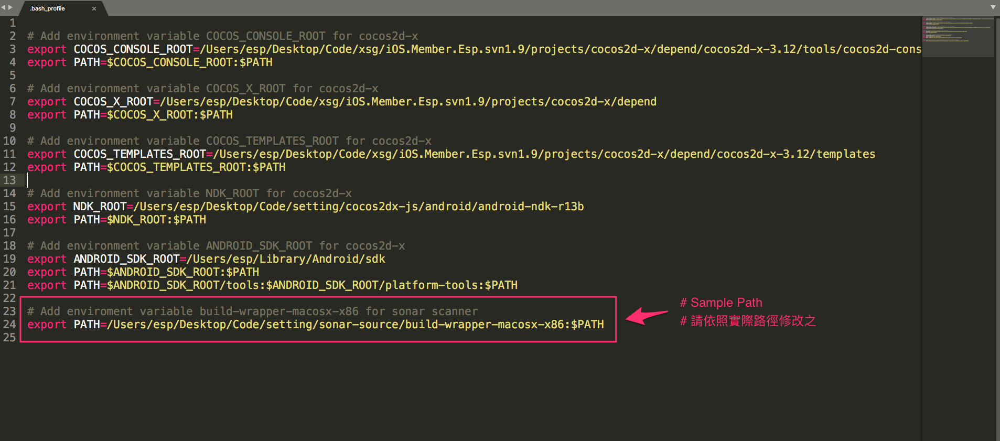
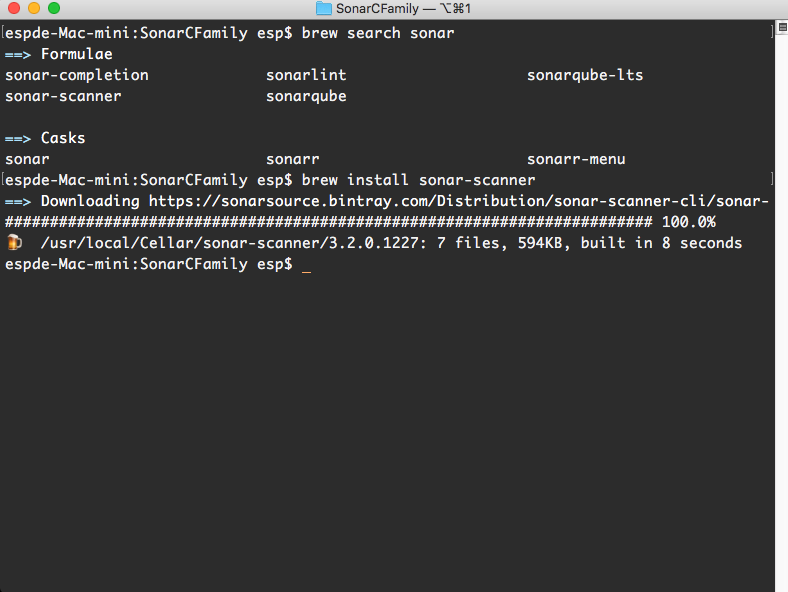

# build-wrapper-macosx-x86_Install
 * 需要透過此程式包裝剖析資料
 * 安裝方式:
   * 官方說明:
    
    * 本地的路徑(範本):
    
    * 環境變數的檔案(範本):
    

# sonar-scanner
 * 安裝方式:
 * terminal => brew search sonar:
 
 * terminal => brew install:
 

  * 官方下載與 brew install 版本差異:
 
