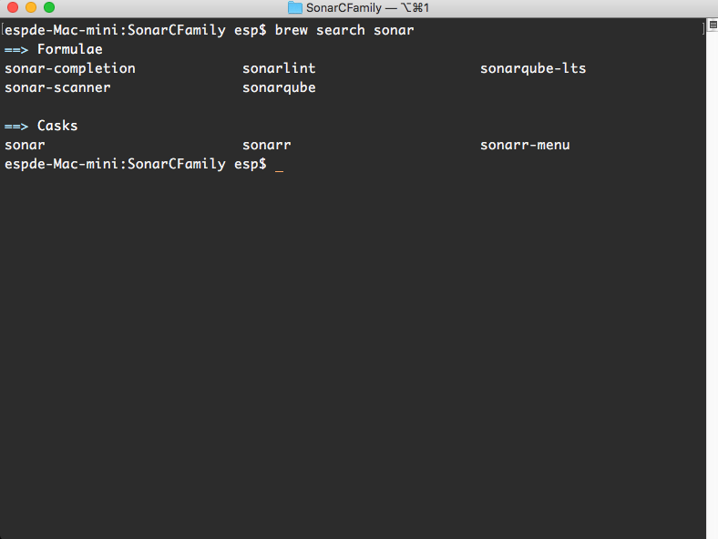
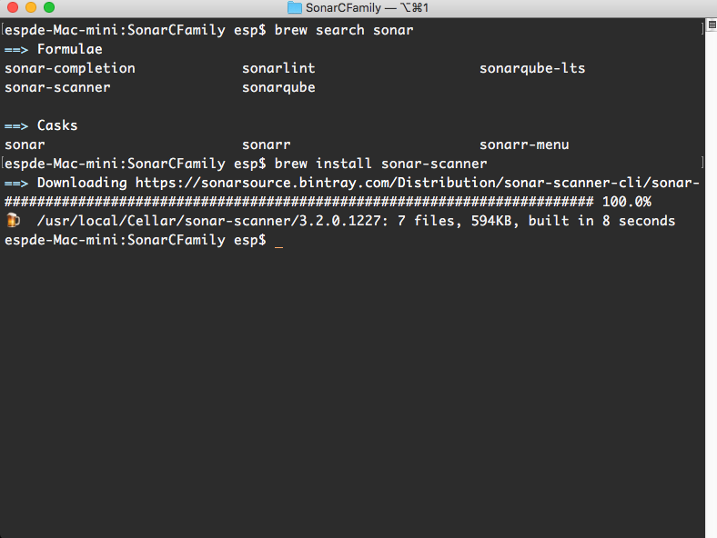
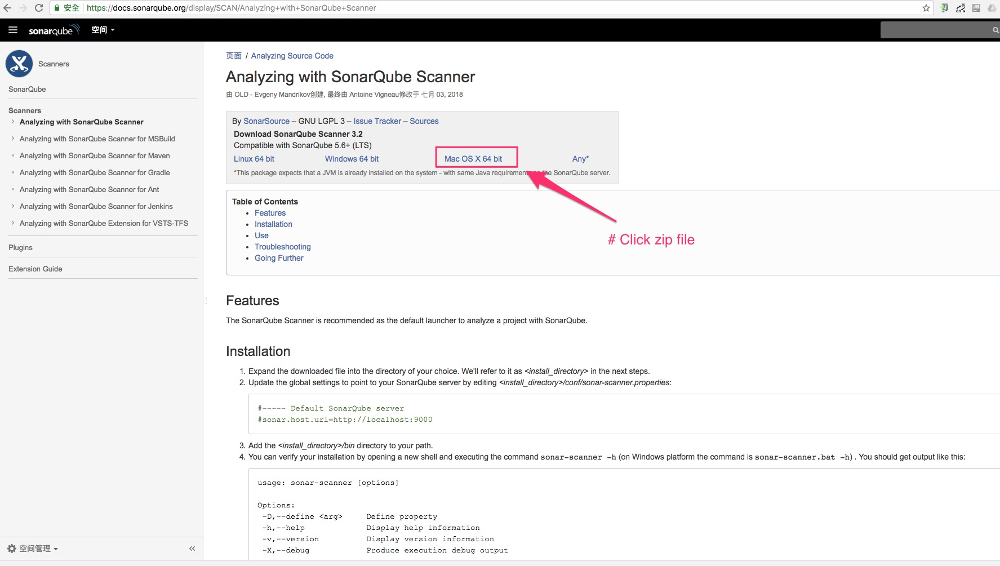
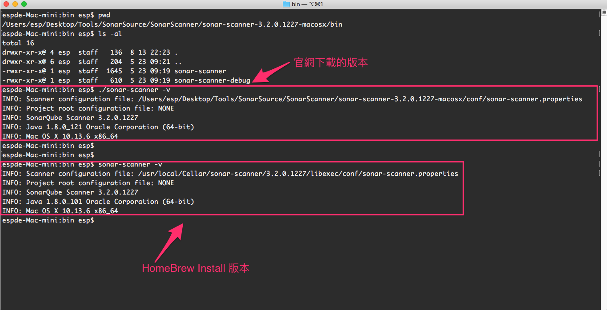

# sonar-scanner
## 安裝方式:

### HomeBrew Install:
* brew search sonar:
  
   
* brew install:
  

### SonarQube Website Install:
* [Analyzing with SonarQube Scanner](https://docs.sonarqube.org/display/SCAN/Analyzing+with+SonarQube+Scanner)

* 簡易說明:
  

### 官方下載與 brew install 版本差異:
* 兩個版本是相同的:
  
