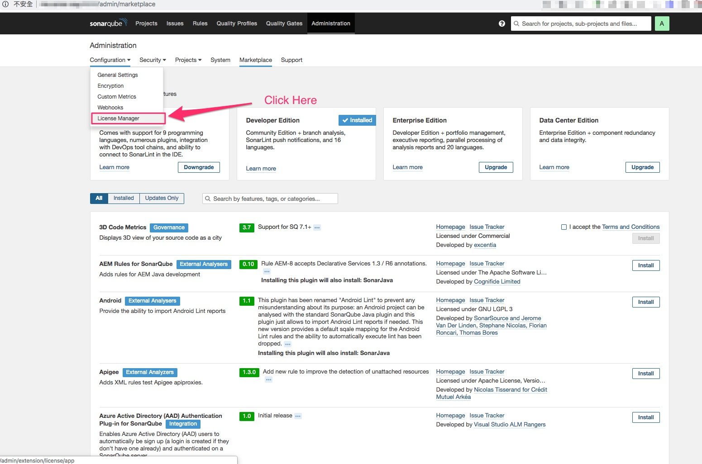

# 介紹從安裝好的 sonar qube 後台設定 License Key 的步驟

* 先安裝好 sonar qube
  * [可參閱 sonar qube 安裝教學](../SonarQubeInstall/README.md)

* 使用的 License Key 為 Developer Edition 版本
  * 需先透過官方網站申請購買，透過 email 往返後，可得到對應版本的 License key

* 設定步驟都直接在 sonar qube 後台 即可操作完成

* 以下會介紹兩種設定License Key的步驟
  * 此 sonar qube 第一次設定 License Key
  * 設定好後，之後續約想要更新 License Key 可在哪更新

---

## 設定步驟如下 (第一次設定 License Key)

* Step1(選擇更新位置：第一次設定 License Key 直接使用對應的版本 Update)

  

* Step2(設定取得的 License Key)

  

* Step3(Click Install to continue)

  

* Step4(AutoInstalling : 等待安裝過程)

  

* Step5(安裝完成，重啟 sonar qube : Click Restart)

  

* Step6(Confirm Restart Button : Click Restart)

  

* Step7(Waiting Restart State)

  

* Step8(Restart sonar qube OK: 需要 Relogin)

  

* Step9(Check License Key 設定狀況: Develope Edition Installed)

  

* Step10(點選支援 Language:可以 Double Check)

  

* Step11(Check Objc，swift 有支援)

  

---

## 綜合上述檢查與申請的版本無誤

---

## 附註 (要更新 License Key 要怎麼處理)

* Step1(Click License Manager：到 License 管理頁面)

  

* Step2(Click Set new license：設定 更新  License)

  
