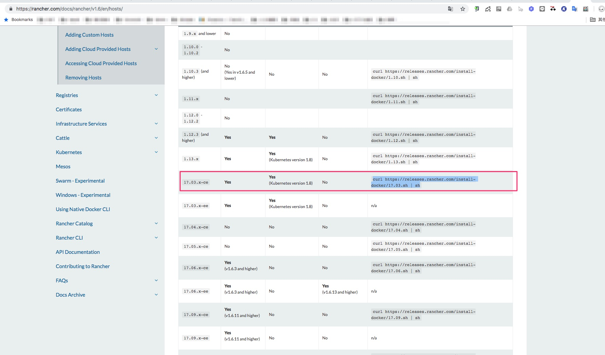
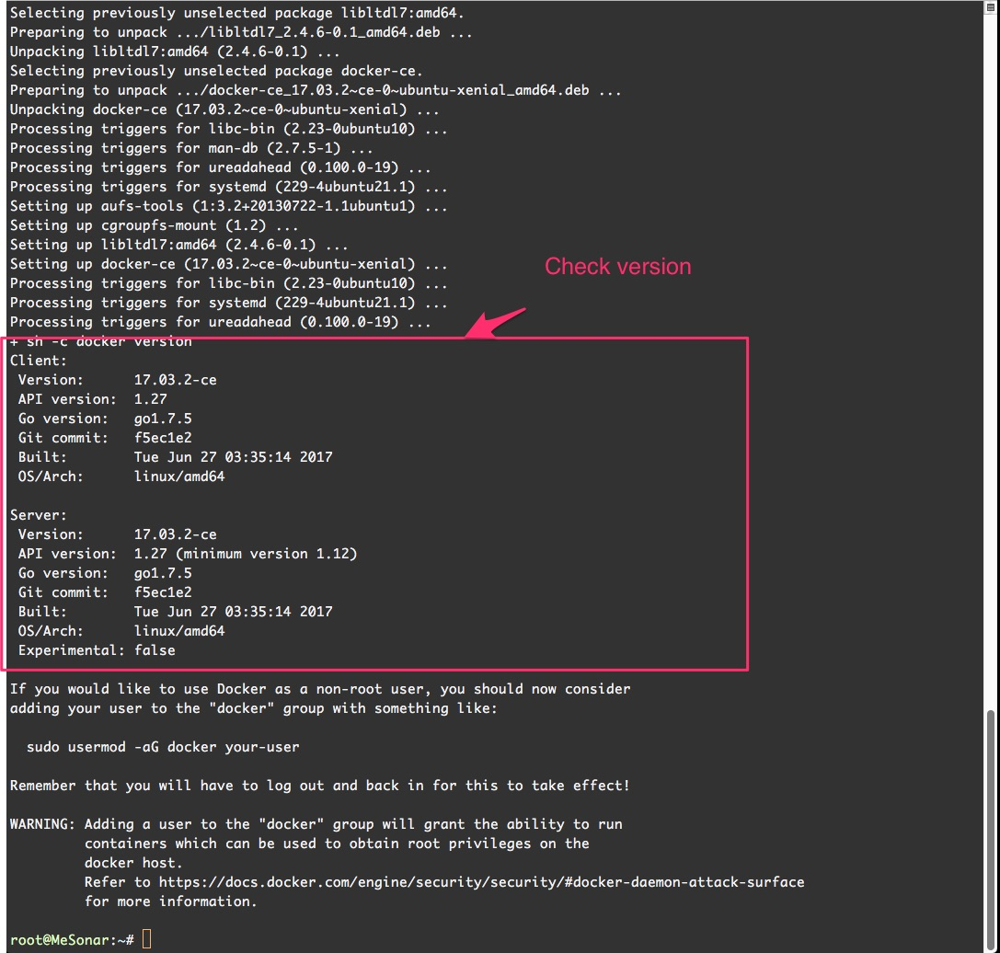

# 介紹建構 sonar qube 的步驟

* info及安裝方式
  * 環境 : ubuntu
  * 預計安裝方式 : rancher 啟動 container 安裝 sonar qube

---

## 安裝步驟如下

* Step0(切換到 sudo 模式，方便之後安裝 @sonar-qube vm)

  

* Step1(mount data: sonar qube 預設的 db 存放碟 @sonar-qube vm)

  

* Step2(檢視 rancher 對應的 docker 版本 @rancher)

  

* Step3(執行 下載並安裝 docker 命令 @sonar-qube vm)

  

* Step4(執行 下載並安裝 docker 命令 過程 1 @sonar-qube vm)

  

* Step5(檢視 docker 安裝版本是否一致 @sonar-qube vm)

  

* Step6(點選 Add Host @rancher)

  

* Step7(copy register host command @rancher)

  

* Step8(執行 register host command @sonar-qube vm)

  

* Step9(Click INFRSTRUCTURE @rancher)

  

* Step10(Set Label with sonar @rancher)

  

* Step11(Check sonar qube is running @rancher)

  

* Step12(Check sonar qube is running @sonar qube 後台)

  
